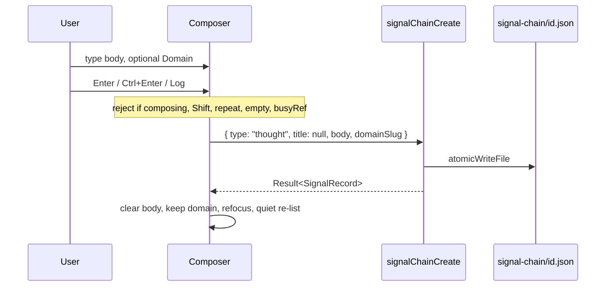
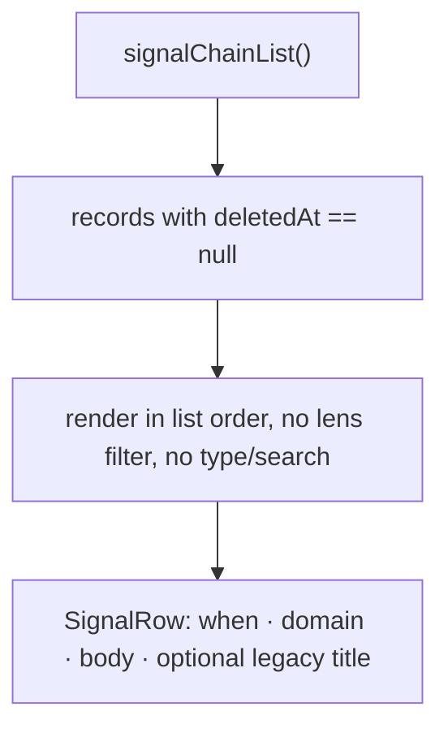
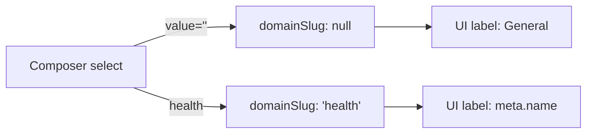

# Life-Chain Quick-Fire Capture — Design Spec

**Date:** 2026-09-04  
**Author:** TBD  
**Status:** Draft  
**Product:** LifeQuest — local-first Electron + React life-management studio  
**Branch:** `feat/hermes-companion-profile`  
**Depends on:** [Life Signal Chain](file:///C:/Users/karms/projects/life-quest/docs/superpowers/specs/2026-08-27-life-signal-chain-design.md), [Overview Domain Lens](file:///C:/Users/karms/projects/life-quest/docs/superpowers/specs/2026-08-31-overview-domain-lens-design.md), [Home Wing](file:///C:/Users/karms/projects/life-quest/docs/superpowers/specs/2026-09-02-home-wing-design.md)

Supersedes, **for Life-Chain only**, the following locked decisions of earlier specs:

| Prior spec | Decision | This spec |
|------------|----------|-----------|
| Life Signal Chain §2 #6, #11, #12 | Typed composer, Add button, day-grouped timeline, type + search filters, composer domain = active lens | Large composer, Enter logs, no type/title/filters, flat newest-first chain, default domain **General** |
| Overview Domain Lens §2 #8, #9, #17 | Unassigned signals visible only in Overview; composer follows lens; top-bar is the Chain filter | Life-Chain is a **global capture database**. The page shows **all** live signals. Composer defaults to General and does not follow the lens. |

Storage, IPC channel names, route `/chain`, nav `id: "chain"`, folder `.lifequest/signal-chain/`, `SCHEMA_VERSION`, and the Life log decoupling are **unchanged**.

---

## Overview

Life-Chain today is a small CRUD form: type, domain, optional title, body, an **Add** button, type + search filters, and a day-grouped timeline with full inline edit. That is too much ceremony for what the page is for — dumping a thought before it evaporates.

This change turns `/chain` into a **quick-fire capture database**: a large composer, Enter to log, a Domain picker defaulting to **General**, and a vertical newest-first list of every human-logged signal. Assignment, processing, and automations/skills are explicitly later. The record shape already has the hooks those features need (`source` / `sourceRef`, optional `domainSlug`, closed `type` enum). We do not add a processing inbox, a `status` field, or a skill runner in this change.

The work is **renderer-first**. `packages/vault-core/src/signal-chain.ts`, the four IPC methods, and `SignalRecord` stay as they are. New captures write `type: "thought"`, `title: null`, `domainSlug: null` (General) or a live domain slug.

---

## Background & Motivation

### Current state (verified in code)

| Layer | Location | Behavior today |
|-------|----------|----------------|
| Route | `apps/desktop/src/App.tsx` (`path="/chain"`), `pages/ChainPage.tsx` | Thin wrapper around `SignalChainFeed`. Do not rename. |
| Nav | `apps/desktop/src/components/shell/nav-items.ts` | `id: "chain"`, `href: "/chain"`, label **Life-Chain**, Home wing, Lucide `Radio`. |
| Page | `apps/desktop/src/components/signal-chain/SignalChainFeed.tsx` | Composer (type, domain, title, body, Add) + type/search filters + day-grouped timeline + inline edit of all fields + `window.confirm` delete. |
| Helpers | `apps/desktop/src/lib/signal-chain.ts` | `filterSignals`, `groupSignalsByDay`, `localDayKey`, `dayLabel`, `formatSignalTime` (time-only). |
| Storage | `packages/vault-core/src/signal-chain.ts` | One JSON file per id under `.lifequest/signal-chain/`. Atomic writes. Soft-delete. Skip-tolerant list, newest `createdAt` first. Not in `VaultSnapshot`. |
| Types | `packages/vault-core/src/types.ts` | `SignalRecord`, `SIGNAL_TYPES`, `SIGNAL_SOURCES`, `SignalCreateInput`, `SignalUpdatePatch`. |
| IPC | `vault-service.ts` / `main.ts` / `preload.ts` / `vite-env.d.ts` | `signalChain:list\|create\|update\|delete`. |
| Lens | `recordVisible` in `packages/vault-core/src/domain-lens.ts` | Feed filters with `records.filter((r) => recordVisible(lens, r.domainSlug))`. Composer domain defaults to `lensSlug(lens) ?? ""` and re-syncs until the user dirties it. |
| CSS | `apps/desktop/src/styles/global.css` (`.signal-chain*` from ~L2625) | Two-column composer grid, sticky day headers, type/domain/actions row chrome. |

Composer defaults: type `thought`, domain = active lens or empty **"Unassigned"**, optional title, required body, submit via **Add**. Textarea Enter inserts a newline. There is no built-in **General** domain; `SEED_DOMAINS` is Health / Intellectual / Emotional / Financial (`packages/vault-core/src/types.ts`). `domainSlug: null` renders as **"No domain"** on rows and **"Unassigned"** / **"None"** in selects.

### Pain points

1. Capture takes five decisions (type, domain, title, body, click Add) for a one-line thought.
2. Enter does not log. Muscle memory from Hermes chat (`ChatPanel` Enter-to-send) is wasted.
3. Type + title are taxonomy the user does not want at capture time.
4. Day grouping and type/search filters add chrome around a list that should read as a dump.
5. Domain lens hides signals. A Health-lens session cannot see General/unassigned or other-domain captures, which contradicts “a database of all important events.”
6. Empty/`null` domain is labeled three different ways (Unassigned / None / No domain).

---

## Goals & Non-Goals

### Goals

- One-gesture capture: focus composer, type, Enter, done.
- Composer is a large card. Domain picker lives in the composer footer, default **General**.
- Chain is a vertical, newest-first list of **all** live signals, independent of the shell domain lens.
- Existing records remain readable (body, timestamps, domain, leftover type/title on disk).
- Soft-delete and lightweight body/domain edit remain.
- IME-safe, key-repeat-safe Enter-to-submit; domain picker fully keyboard-operable.
- Mutations must not flash `Loading chain…`.
- No schema bump, no IPC rename, no route rename, no storage-folder rename.

### Non-goals (this change)

- Automation runners, skill matching, processing inbox, Notion, HTTP ingest.
- `status` / `processedAt` / assignment-link fields.
- Restore-deleted UI.
- Pagination or virtualization (full non-deleted folder load stays; no evidence of scale pain).
- Life log coupling.
- Theme system / skin / token architecture changes.
- Making `type` or `title` optional in `parseSignalRecord`.
- Seeding a real `general` vault domain.

---

## Key Decisions

1. **Capture first, process later — no `status` field.** Processing is future assignment onto other vault objects (task, library note, decision, doctrine), not a workflow state machine on the signal. Keep `source` / `sourceRef` as the ingest hook they already are. Adding `status` now would force an inbox UI we are not building and a `SCHEMA_VERSION` discussion we do not need.

2. **Renderer-only. Schema and IPC stay.** New captures send `type: "thought"`, `title: null`, and `domainSlug: null` or a real slug. `SignalCreateInput.type` remains required at the vault-core boundary; the renderer always supplies `"thought"`. Existing typed/titled records are untouched.

3. **"General" is a synthetic label for `domainSlug: null` (Option A).** No `domains/general/` folder, no seed, no migration. Picker first option is General (`value=""`). Rows with `null` slug display **General** (replacing "No domain" / "Unassigned").

4. **Life-Chain ignores the domain lens.** The page is a global capture database, not a domain-scoped list. This reclassifies the page relative to `LAWS/DOMAIN-FILTER.md` and supersedes Overview Domain Lens decisions 8, 9, and 17 for this page only. Documents keeps `recordVisibleMulti`; Dashboard, Log, Act, Personnel, and Decisions keep `recordVisible`.

5. **Composer domain defaults to General and does not follow the lens.** Last-picked domain **sticks for the session** (burst capture into Health stays on Health until the user changes it). Mount → `domainSlug = ""` (General). Success → keep domain, clear body. Any error (create, list, update, or delete) → keep body and domain, show `role="alert"`. Remove `domainDirty` / `lensSlug` sync on both the success and error paths.

6. **Enter and Ctrl/Cmd+Enter log; only Shift+Enter inserts a newline.** Same mapping as `ChatPanel.onKeyDown` (`Enter && !shiftKey` sends). IME-safe (`isComposing` / `keyCode === 229`) and key-repeat-safe (`e.repeat`). Footer control is `<Button type="submit" variant="ghost">Log</Button>` — Enter is the primary path, not a missing button.

7. **Drop type picker, title field, type filter, and search from the page.** Type filter is dead without a type picker. Search is YAGNI at current volume. `filterSignals` stays in the helper module as unused-by-UI plumbing.

8. **Drop day grouping.** User asked for a simple vertical chain, newest → oldest. Sticky day headers were the old spec’s structure, not a capture need. Each row carries its own datetime so the list still scans in time.

9. **Keep soft-delete + body/domain edit; drop type/title from row chrome and the edit form.** Legacy `title` still renders when non-null so old data is readable. Edit patches `{ body, domainSlug }` only — **omit** `type` and `title`. Sending `title: null` would wipe a legacy title (`updateSignal` L253–256).

10. **No `SCHEMA_VERSION` bump.** Additive display-label change and renderer behavior. `parseSignalRecord` already accepts `domainSlug: null`.

11. **Quiet refresh after mutations.** Initial `load()` may `setLoading(true)`. After create/update/delete, call `load({ quiet: true })` and never `setLoading(true)`. Pattern: `DocumentEditor.tsx`. `busyRef` + `e.repeat` close the double-submit hole.

---

## Proposed Design

### 3.1 Architecture (unchanged below the renderer)

```
┌─────────────────────────────────────────────────────────┐
│  Shell: Home wing · /chain · domain lens (ignored here) │
│                                                         │
│  ┌─────────────────────────────────────────────────┐    │
│  │  Composer card                                  │    │
│  │   large textarea  (Enter = log)                 │    │
│  │   Domain [General ▾]   ↵ Log                    │    │
│  └─────────────────────────────────────────────────┘    │
│  Chain (flat <ul>, newest first)                        │
│   · body · when · General|Health · Edit/Delete          │
└───────────────────────────┬─────────────────────────────┘
                            │ api().signalChainList/Create/Update/Delete
                            ▼
              Electron vault-service (unchanged)
                            ▼
         vault-core  .lifequest/signal-chain/<id>.json
```

`ChainPage` stays a one-line wrapper. All UI lives in `SignalChainFeed` (optionally split composer/row later; not required for this PR).

### 3.2 Capture flow



Create payload from the new UI:

```ts
await api().signalChainCreate({
  type: "thought",          // schema still requires it; UI no longer chooses
  title: null,
  body,                     // trimmed by vault-core
  domainSlug: domainSlug.trim() ? domainSlug : null,  // "" → General
});
```

`createSignal` in `packages/vault-core/src/signal-chain.ts` already forces `source: "manual"`, `sourceRef: null`, generates UUID / timestamps. No vault-core change.

**Composer field policy (locked):**

| Event | Body | Domain |
|-------|------|--------|
| Mount | `""` | `""` (General) |
| Create success | clear to `""` | **keep** last pick |
| Create / list / update / delete error | **keep** | **keep** |
| Update / delete success | (n/a — composer unchanged) | **keep** |

`setEditingId(null)` on create success. Leave focus in the textarea.

**Quiet refresh — never blank the chain after a mutation.** Today `load()` always does `setLoading(true)`, and the tree is `loading ? "Loading chain…" : …list` (`SignalChainFeed.tsx` L53–70, L264–275). Re-listing after Enter would unmount the list and flash the loading copy. Split initial load from refresh, same pattern as `DocumentEditor` (`opts?: { quiet?: boolean }`, skip `setLoading` when quiet — `DocumentEditor.tsx` L79, L95, L140):

```ts
const busyRef = useRef(false);

const load = useCallback(async (opts?: { quiet?: boolean }) => {
  if (!opts?.quiet) setLoading(true);
  setError(null);
  try {
    const result = await api().signalChainList();
    // …same ok/error handling as today
  } finally {
    if (!opts?.quiet) setLoading(false);
  }
}, []);

useEffect(() => {
  void load();
}, [load]);

async function onAdd(e: React.FormEvent) {
  e.preventDefault();
  if (!body.trim() || busyRef.current) return;
  busyRef.current = true;
  setBusy(true);
  setError(null);
  try {
    const result = await api().signalChainCreate({ /* … */ });
    if (!result.ok) {
      setError(result.error);
      return; // keep body and domain
    }
    setBody("");
    setEditingId(null);
    await load({ quiet: true });
  } catch (err) {
    setError(err instanceof Error ? err.message : "Failed to add signal");
  } finally {
    busyRef.current = false;
    setBusy(false);
  }
}
```

`onSave` / `onDelete` also call `load({ quiet: true })` — never `setLoading(true)` after create/update/delete. `busy` already covers in-flight. Do **not** require optimistic prepend for v1; quiet re-list is enough. Optional prepend of the returned `SignalRecord` is allowed later, not in this PR.

### 3.3 Composer

Replace the current two-column `.signal-chain__composer` grid with a single card:

```
┌──────────────────────────────────────────────────────────┐
│  What's on your mind?                                    │
│                                                          │
│                                                          │
├──────────────────────────────────────────────────────────┤
│  Domain  [ General        ▾ ]     ↵ Log                  │
│  Enter to log · Shift+Enter for a new line               │
└──────────────────────────────────────────────────────────┘
```

**Structure**

- `<form className="signal-chain__composer" onSubmit={onAdd}>`
- Large `<textarea>` with `aria-label="Log a signal"` (do **not** invent a `.visually-hidden` / `.sr-only` class — none exists in `global.css` / `tokens.css`; `RealWeek.tsx` uses the class name with no matching rule). `rows={6}` or CSS `min-height` ~8rem, `resize: vertical`, `autoFocus`, `required` kept as a fallback. Placeholder is the visible prompt.
- Footer row:
  - Native `<select>` labeled **Domain** (visible `<label>`). Options: `General` (`value=""`) then live (non-archived) domains by `meta.name`. Keyboard: Tab onto it, arrows, type-ahead — native select, no custom menu.
  - Exactly: `<Button type="submit" variant="ghost" disabled={busy || !body.trim()}>Log</Button>`. `Button` defaults to `type="button"` (`Button.tsx`); omitting `type="submit"` would not submit the form. Not the visual hero; the textarea is. Do not use raw `btn btn-secondary`.
  - Hint line using the same `<kbd>` treatment as `.chat-panel__composer-help`: `Enter` log · `Shift+Enter` newline. (Ctrl/Cmd+Enter also logs — documented in §3.4, not on the hint, matching ChatPanel’s help line.)

**Removed from the composer:** Type `<select>`, Title `<input>`, primary **Add** button, lens-sync `useEffect`.

**Placeholder copy:** `What's on your mind?` — calm, not toy-like (`PRODUCT.md`). Header description under **Life-Chain** becomes: `A database of what you notice. Log now; assign later.`

### 3.4 Enter-to-submit (IME-safe)

Textarea Enter does not submit a form natively, so handle `keydown` explicitly. Match Hermes, then add the IME guards `ChatPanel.onKeyDown` is missing:

```ts
function onComposerKeyDown(e: KeyboardEvent<HTMLTextAreaElement>) {
  if (e.key !== "Enter" || e.shiftKey) return;
  if (e.repeat) return;
  // IME: do not fire while composing (CJK etc.) or on the 229 sentinel.
  if (e.nativeEvent.isComposing || e.keyCode === 229) return;
  e.preventDefault();
  e.currentTarget.form?.requestSubmit();
}
```

`busyRef` in `onAdd` (set true **before** the `await`, checked synchronously at the top) is the second half of the double-submit lock: holding Enter fires repeated `keydown`s, and React `busy` state would not have committed yet. Both guards are required.

| Key | Result |
|-----|--------|
| Enter | Log (if body non-empty and not busy) |
| Shift+Enter | Newline (the only Enter chord that does **not** log) |
| Ctrl/Cmd+Enter | **Log** (same as Hermes: only `shiftKey` blocks submit) |
| Enter while `e.repeat` | Ignored |
| Enter during IME composition | Ignored |

**Why only Shift+Enter newlines:** LifeQuest already trains this on Hermes (`apps/desktop/src/components/hermes/ChatPanel.tsx` L211–218: `e.key === "Enter" && !e.shiftKey` sends; the `<kbd>` help line is Enter send · Shift+Enter newline). Ctrl/Cmd+Enter therefore logs, not newlines — matching ChatPanel, not inverting it.

`requestSubmit()` runs the form’s `onSubmit` (`onAdd`), so the button path and the Enter path share validation (`!body.trim() || busyRef.current`).

**Enter on the Domain `<select>`:** native HTML form implicit submission. Tab to Domain, arrow to Health, Enter **logs** the signal (if body is non-empty). That is acceptable and locked — it is a feature for keyboard capture, not a bug. Do not `preventDefault` Enter on the select. The textarea handler is irrelevant while the select is focused; this is form-level submit, the same path as the Log button.

### 3.5 Chain view

`listSignals` already returns newest `createdAt` first, then `id` desc. Render that order as a flat `<ul className="signal-chain__list">`. No `groupSignalsByDay`, no sticky `.signal-chain__day-header`.



**Row (read)**

```
┌──────────────────────────────────────────────────────────┐
│  Caught myself stalling on the How doc.                  │
│  Optional legacy title, if present                       │
│  Today, 3:42 PM  ·  General            Edit    Delete    │
└──────────────────────────────────────────────────────────┘
```

- Body first, in `.signal-row__content` / `.signal-row__body`: `white-space: pre-wrap`, no Markdown (unchanged).
- Domain: `signalDomainLabel(slug, allDomains)` — **General** when `domainSlug === null`; else `meta.name` or the raw slug if unknown. Pass the full domain list (live + archived) so archived names resolve.
- No type badge. Delete `.signal-row__type`.
- Legacy `title`: render **under** the body as `.signal-row__title` only when `s.title` is non-null/non-empty (today it sits above the body at L446–447). Not editable in this chrome.
- Timestamp: `formatSignalWhen` (see §3.6). Use `<time dateTime={createdAt}>`.
- Actions: `<Button type="button" variant="ghost">` for both Edit and Delete. Delete still `window.confirm("Delete this signal? It will be hidden from the chain.")` then `signalChainDelete` (soft-delete). Do not use `destructive` / `btn-danger` — keep confirm, consistent with today.

**Row (edit)**

Inline form: body `<textarea>` + Domain `<select>` + Save / Cancel. **No type. No title.** Blank option is **General** (`value=""`) — not “None” (today L385). Plus live domains, plus the row’s current slug if archived/unknown (keep the existing `domainOptions` splice in `SignalRow`). Save:

```ts
void props.onSave(s.id, {
  body,
  domainSlug: domainSlug.trim() ? domainSlug : null,
});
```

**Omit `type` and `title` from the patch.** `updateSignal` leaves them alone when omitted (`packages/vault-core/src/signal-chain.ts` L235–256). Sending `title: null` **would wipe** a legacy title (`normalizeTitle` on a present `patch.title`). `createdAt` stays displayed, not editable.

Save: `<Button type="submit" variant="ghost" disabled={props.busy || !body.trim()}>Save</Button>`. Cancel: `<Button type="button" variant="ghost" disabled={props.busy}>Cancel</Button>`.

Enter in the edit textarea: **newline** (not save). Do not add a submit-on-Enter handler on the edit textarea — default textarea behavior. Edit is a correction surface, not a second capture box.

Escape cancels. There is no Escape handler on `SignalRow` today; add one on the edit `<form>`:

```ts
function onEditKeyDown(e: KeyboardEvent<HTMLFormElement>) {
  if (e.key !== "Escape") return;
  if (e.nativeEvent.isComposing) return;
  e.preventDefault();
  props.onCancel();
}
```

Do not use a document listener. IME composition must not cancel.

**Empty / error**

| State | Copy |
|-------|------|
| Loading | `Loading chain…` |
| `records.length === 0` | `Nothing on the chain yet. Write something above.` |
| `skipped > 0` | existing `{n} signal file(s) could not be read.` |
| `error` | existing `role="alert"` |
| Filters match none | **gone** (no filters) |

### 3.6 Timestamps without day groups

`formatSignalTime` currently returns `toLocaleTimeString(..., { timeStyle: "short" })` because the day lived in the sticky header. With a flat list that is not enough.

Add these signatures to `apps/desktop/src/lib/signal-chain.ts` (keep the module pure — no vault snapshot import; the caller passes the domain list):

```ts
export function signalDomainLabel(
  slug: string | null,
  domains: { slug: string; name: string }[],
): string {
  if (!slug) return "General";
  return domains.find((d) => d.slug === slug)?.name ?? slug;
}

export function formatSignalWhen(iso: string, now: Date = new Date()): string {
  try {
    const d = new Date(iso);
    if (Number.isNaN(d.getTime())) return iso;
    const time = d.toLocaleTimeString(undefined, { timeStyle: "short" });
    const label = dayLabel(localDayKey(iso), now);
    if (label === "Today" || label === "Yesterday") return `${label}, ${time}`;
    return d.toLocaleString(undefined, {
      dateStyle: "medium",
      timeStyle: "short",
    });
  } catch {
    return iso;
  }
}
```

- Same local day as `now` → `Today, 3:42 PM`.
- Yesterday → `Yesterday, 3:42 PM`.
- Else → `dateStyle: "medium"` + `timeStyle: "short"` (same idea as `HomePage.formatWhen`).
- Invalid / unparseable `iso` → return `iso` (same fallback as today’s `formatSignalTime`).

Keep `formatSignalTime` as the time fragment used by `formatSignalWhen`, or inline it. Keep `groupSignalsByDay` in the helper file and its tests — unused by the page, cheap, and the date math is already proven. Do not call it from `SignalChainFeed`.

`SignalChainFeed` calls `signalDomainLabel(item.domainSlug, allDomains)` where `allDomains` is `(snapshot?.domains ?? []).map((d) => ({ slug: d.slug, name: d.meta.name }))` so archived names resolve.

### 3.7 Domain: General (Option A)



**Why not a real `general` domain (Option B)**

- `SEED_DOMAINS` has no General. Creating one would add a folder, Why/What/How doctrine files, a DomainSwitcher tab, Map/Act/Personnel tenancy, and a migration of existing `null` slugs.
- Overview is already a virtual lens, not a folder (`overview-domain-lens` decision 1). General as a virtual capture bucket is the same pattern.
- `createSignal` rejects unknown slugs (`Unknown domain: …`). Writing `domainSlug: "general"` without a folder would 400 every capture. Seeding on vault open is a schema/product change this page does not warrant.
- Existing `null` rows already mean “unassigned.” Relabeling them General is the migration-free path.

**Picker rules**

| Context | Options |
|---------|---------|
| Composer | General + live (`!meta.archivedAt`) domains |
| Row edit | Same, plus the row’s current slug if it is archived or missing from live (existing `SignalRow` logic) |

**Display rules** (`signalDomainLabel(slug, domains)` — see §3.6 for the signature)

| `domainSlug` | Lookup in `domains` | Label |
|--------------|---------------------|-------|
| `null` | — | **General** |
| live slug | `name` for that slug | name |
| archived slug | `name` for that slug (pass archived too) | name (not hidden) |
| unknown slug | miss | raw slug |

Default on mount: `useState("")` — General. **Do not** initialize from `lensSlug(lens)`. Success keeps the select; errors keep body and domain (table in §3.2). Remove:

```ts
const [domainSlug, setDomainSlug] = useState(lensSlug(lens) ?? "");
const domainDirty = useRef(false);
useEffect(() => {
  if (domainDirty.current) return;
  setDomainSlug(lensSlug(lens) ?? "");
}, [lens]);
```

Sticky last-pick: after a successful log, do not reset the select. A Health burst stays on Health until the user switches back to General. A failed log leaves the draft (body + domain) in the composer — never jump the picker to General on error.

### 3.8 Domain lens: show all

Today (`SignalChainFeed.tsx` L78–81):

```ts
const scoped = records.filter((r) => recordVisible(lens, r.domainSlug));
return filterSignals(scoped, { type: filterType, domainSlug: "all", query });
```

`recordVisible` (`packages/vault-core/src/domain-lens.ts`): Overview → everything; domain lens → `domainSlug === lens.slug` only. Unassigned/`null` (now General) **disappears** on a domain tab.

**Lock: do not call `recordVisible` (or `useDomainLens`) in `SignalChainFeed`.** Render `records` as returned by `signalChainList`.

**Law reading**

- `LAWS/WINGS.md`: *Wings MUST NOT filter … any page's data.* Orthogonal — we are not filtering by wing.
- `LAWS/DOMAIN-FILTER.md`: *The domain switcher MUST be the data filter for domain-scoped lists.* Life-Chain is hereby **not** a domain-scoped list. It is a global capture database. Domain on a signal is an **assignment tag for later processing**, set in the composer, not a view filter.
- Overview Domain Lens spec treated Chain as lens-filtered (decisions 8, 9, 17) and removed the in-page domain **filter** dropdown. That was correct then. The product ask now is “a database of ALL important events.” Capture while standing in Health must not hide yesterday’s Financial thought.

**Clarify the law** in the same PR. `LAWS/README.md` requires each law file to state **one** requirement. Do not append a second MUST. Rewrite the existing sentence in `LAWS/DOMAIN-FILTER.md` to:

> The domain switcher MUST be the data filter for domain-scoped lists (Life-Chain is a global capture database and is not domain-scoped).

`apps/desktop/tests/constitution.test.ts` asserts `/domain switcher MUST/` — that still matches. Do not add `LAWS/LIFE-CHAIN.md`. Do not edit the 2026-08-27 / 2026-08-31 spec files; the supersedes table at the top of this document is the same pattern Home wing used.

Dashboard, Log, Act, Personnel, and Decisions stay lens-filtered via `recordVisible`. Documents stays lens-filtered via `recordVisibleMulti`. Composer domain is independent of the switcher. The DomainSwitcher remains visible on `/chain` (it still filters other pages; see alternative H).

`apps/desktop/tests/domain-lens-shell.test.ts` currently **requires** `recordVisible` and `lensSlug|useDomainLens` in `SignalChainFeed.tsx`. Invert that assertion (see Tests).

### 3.9 Filters

Drop the entire `.signal-chain__filters` block (type select + search input).

| Filter | Verdict |
|--------|---------|
| Type | Drop. No type picker, nothing to filter. |
| In-page domain | Already gone (lens was the filter). Stay gone. Composer picker is assignment, not a filter. |
| Search | Defer. Personal dumps, full list in memory, browser find (`Ctrl+F`) covers the rare hunt. Re-wire `filterSignals` later if volume hurts. |

`filterSignals` remains in `apps/desktop/src/lib/signal-chain.ts` with its tests. The page does not import it.

### 3.10 Future processing hooks (not built)

Leave the door open without painting a workflow:

| Hook | Status |
|------|--------|
| `source` / `sourceRef` | Keep. Manual UI always writes `manual` / `null`. Automations and Notion land later without a storage migration (original spec decision 6). |
| `type` | Keep in schema. UI writes `thought`. A future skill matcher can reclassify via `signalChainUpdate({ type })` without a new field. |
| `title` | Keep nullable. UI writes `null`. Future “promote to note” can fill it. |
| `domainSlug` | The assignment hook we are actually exposing. General = unfiled. |
| `status` / `processedAt` / `links[]` | **Do not add.** Processing = create/link another vault object (task, library doc, decision) in a later spec. A status enum would demand an inbox we are not shipping. |

No new columns, no new IPC, no runner.

### 3.11 Styling

Restyle existing `.signal-chain*` rules in `apps/desktop/src/styles/global.css`. Do not add a design-system file, `PageShell`, or `card-glass`.

Use tokens already on the sheet:

- Card: `background: var(--composer-bg)` / `var(--card)`, `border: 1px solid var(--composer-border)`, `border-radius: var(--radius-md)` (18px, same as settings cards), optional `box-shadow: var(--shadow-sm)`.
- Inputs/select/textarea: `border-radius: var(--radius-sm)` (12px), not pills (`apps/desktop/src/components/ui/AGENTS.md`).
- Buttons: `Button` primitive only (pills via `.btn`). Locked variants:
  - Composer Log: `<Button type="submit" variant="ghost">`
  - Edit Save: `<Button type="submit" variant="ghost">`
  - Edit Cancel, row Edit, row Delete: `<Button type="button" variant="ghost">`
  - Delete is **not** `destructive`. Keep `window.confirm`.
- Textarea: `min-height` ~8rem (align with `.library-composer .field textarea`), `font: inherit`, `line-height: 1.45`.
- Composer layout: `display: flex; flex-direction: column;` — drop the two-column grid it currently **shares** with `.signal-chain__filters` and `.signal-row__form` (`global.css` L2636–2643). Footer is `display: flex; align-items: center; justify-content: space-between; gap: …`.
- **Edit form gets its own stacked rule** — do not leave `.signal-row__form` on the old 2-col grid after the composer becomes a column:

```css
.signal-row__form {
  display: flex;
  flex-direction: column;
  gap: 0.65rem;
}
```

- Chain list: existing `.signal-chain__list` column flex + gap. Replacement row template (body first, then when · domain · actions — no `type` hole):

```css
.signal-row {
  display: grid;
  grid-template-columns: auto 1fr auto;
  grid-template-areas:
    "content content content"
    "when domain actions";
  gap: 0.25rem 0.7rem;
  padding: 0.7rem 0.8rem;
  border: 1px solid var(--border);
  border-radius: var(--radius-md);
  font-size: 0.875rem;
}

@media (max-width: 36rem) {
  .signal-row {
    grid-template-columns: 1fr;
    grid-template-areas:
      "content"
      "when"
      "domain"
      "actions";
  }
}
```

- Delete unused rules in the same CSS pass: `.signal-chain__filters`, `.signal-chain__search`, `.signal-chain__title-field`, `.signal-chain__day-header`, `.signal-chain__day`, `.signal-row__type`. Drop those selectors from the existing `@media (max-width: 36rem)` group (it currently restyles `.signal-chain__composer, .signal-chain__filters, .signal-row__form` together).
- Page column: keep `.signal-chain { max-width: 48rem; }`.
- `<kbd>` hint: a local `.signal-chain__hint kbd` copy of `.chat-panel__composer-help kbd` — do not invent a new kbd system.
- Replace hardcoded `0.4rem` / `0.5rem` radii on these rules with `--radius-sm` / `--radius-md` while touching the block. Do not retokenize the rest of `global.css`.

Header stays `stub-page__title` / `stub-page__desc muted` so the page title still matches the rail (**Life-Chain** — asserted by `wing-shell.test.ts`).

---

## API / Interface Changes

**None at the IPC / vault-core boundary.**

| Surface | Change |
|---------|--------|
| `signalChain:list\|create\|update\|delete` | Unchanged |
| `SignalCreateInput` | Unchanged (`type` still required; renderer always sends `"thought"`) |
| `SignalUpdatePatch` | Unchanged; UI sends `{ body, domainSlug }` only |
| `SignalRecord` | Unchanged |
| `parseSignalRecord` | Unchanged |
| Route `/chain`, nav id `chain`, folder `signal-chain/` | Unchanged |
| `SCHEMA_VERSION` | Stays `1` |

Renderer contract (documentation only — not a type change):

```ts
// New captures from SignalChainFeed
type QuickFireCreate = {
  type: "thought";
  title: null;
  body: string;                 // non-empty after trim
  domainSlug: string | null;    // null = General
};
```

---

## Data Model Changes

**No storage migration. No schema bump.**

Existing files keep `type`, `title`, `domainSlug` as written. New files look like:

```json
{
  "id": "…",
  "createdAt": "2026-09-04T18:02:11.000Z",
  "updatedAt": "2026-09-04T18:02:11.000Z",
  "deletedAt": null,
  "type": "thought",
  "source": "manual",
  "sourceRef": null,
  "title": null,
  "body": "Caught myself stalling on the How doc.",
  "domainSlug": null
}
```

`domainSlug: null` is already valid (`parseSignalRecord` L57, `normalizeDomain`). Display-only change to “General”.

Soft-delete, skip-tolerant list, pretty JSON + trailing newline, `createdAt` immutability — all unchanged.

---

## Alternatives Considered

### A. Real `general` vault domain (Option B)

Seed `domains/general/` (or ensure-on-open), migrate `null` → `"general"`, show it in the DomainSwitcher.

- **Pros:** Domain lens could keep filtering; General signals would appear on a General tab; `recordVisible` stays consistent.
- **Cons:** Pollutes doctrine, switcher, Map, Act, Personnel; needs ensure-on-open for old vaults; `createSignal("general")` 400s until the folder exists; Overview-as-virtual vs General-as-real is inconsistent. Rejected.

### B. Keep lens filtering; composer default General

Show only the active domain’s signals, but capture defaults to General (`null`).

- **Pros:** Obeys Overview Domain Lens decisions 7–8 without a law change.
- **Cons:** Logging a General thought while the Health tab is selected **hides the row you just added**. That is a broken capture loop. Rejected.

### C. Follow the lens for composer default, show all in the list

Default domain = active lens (today), list unfiltered.

- **Pros:** Fast filing when you are already in Health.
- **Cons:** User asked for default **General**. Capture-first means “dump unfiled, file later.” Sticky last-pick still covers Health bursts without coupling to the shell. Rejected as the default; last-pick recovers the speed.

### D. Keep day grouping

Sticky **Today / Yesterday / date** headers, items nested.

- **Pros:** Already built and tested; scans long history by day.
- **Cons:** Extra chrome vs “vertical layout of all signals”; `formatSignalTime` is time-only because of it; user asked to simplify. Dropped. Date math stays in the helper module.

### E. Capture-only (no edit/delete)

Inbox purity.

- **Cons:** Typos and wrong-domain dumps have no fix except a hidden soft-delete file. Soft-mutable was the original spec’s right call (`createdAt` immutable, body/domain editable). Keep a thin edit/delete.

### F. Add `status: "inbox" | "processed"` now

- **Pros:** Honest about “process later.”
- **Cons:** Demands UI (tabs, mark-done), a schema field, and a version bump conversation. Processing is assignment onto other objects. Rejected.

### G. Ctrl+Enter for newline / Enter always newline + Log button only

- **Cons:** Fights Hermes and the user’s “Enter logs the signal” requirement. Rejected. Ctrl/Cmd+Enter logs (only Shift+Enter newlines).

### H. Hide or disable DomainSwitcher on `/chain`

So the top-bar chrome does not look like a Chain filter.

- **Pros:** Avoids the Medium risk that a Health tab still *looks* like it scopes the dump.
- **Cons:** The switcher is shell chrome, not page chrome; it still filters Dashboard / Log / etc. when the user navigates away. Hiding it on one route is a special case and implies Life-Chain is outside the studio. Domain on each row is the assignment tag. Switcher stays. Rejected.

### I. Optimistic prepend vs. quiet re-list vs. today’s blanking `load()`

- Blanking `load()` (`setLoading(true)` after Enter) flashes “Loading chain…” — rejected (Issue 1).
- Optimistic prepend of the returned `SignalRecord` is nice but extra merge logic for a v1 dump.
- **Chosen:** quiet re-list (`load({ quiet: true })`). Keep existing rows on screen; `busy` / `busyRef` cover in-flight. No optimistic prepend required for this PR.

---

## Security & Privacy Considerations

| Topic | Handling |
|-------|----------|
| Path traversal | Unchanged: ids through `safeJoin` in `vaultPaths().signalChainJson`. Covered by `packages/vault-core/tests/signal-chain.test.ts`. |
| XSS | Body is text in React (`{s.body}`), not `dangerouslySetInnerHTML`. Keep it that way. No Markdown. |
| Confirm-delete | Keep `window.confirm`. Accidental Enter-to-log is cheap (edit/delete exist); accidental delete is not. |
| Soft-delete | Files remain on disk with `deletedAt`. No restore UI (out of scope). Same as today. |
| Life log | Still not written on signal CRUD. Chain is not an audit trail. |
| Lens bypass | Intentional: this page shows all live signals in an unlocked vault. Same confidentiality as Overview on Log/Dashboard. No new network surface. |
| IPC | Unchanged `Result<T>` channels; still require an open vault via `withVault`. |

Threat model is unchanged from the 2026-08-27 spec: local vault, no sharing, no encryption work in this change.

---

## Observability

No new metrics backend (desktop app, no telemetry pipeline in-repo).

| Signal | How |
|--------|------|
| Initial load | `setLoading(true)` → `Loading chain…` (first paint only) |
| Load failure | existing `role="alert"` error string from IPC; body and domain **kept** |
| Partial list | existing `skipped` banner |
| Empty | `Nothing on the chain yet. Write something above.` |
| In-flight mutation | `busy` / `busyRef` disable Log / Edit / Delete; composer stays usable to type; list **stays mounted** (quiet re-list, no loading copy) |

Do not log signal bodies to the console. No Life log events.

---

## Rollout Plan

Local-first desktop: no feature flag, no staged cohort.

1. Land the renderer PR on `feat/hermes-companion-profile` (or a branch off it).
2. Existing vaults: open `/chain`, see old rows (titles if any, domains including null→General), composer is the new card.
3. Rollback: revert the renderer/CSS/test/law diff. On-disk JSON remains valid either way.

No data migration to run, no `SCHEMA_VERSION` gate, no IPC versioning.

---

## Risks

| Risk | Severity | Mitigation |
|------|----------|------------|
| Users who used the Health lens as a Chain filter now see everything | Medium | Intentional. Domain still shows on every row. Search deferred; Ctrl+F works. DomainSwitcher stays (alternative H rejected). Law carve-out is parenthetical, one MUST. |
| Enter-to-submit surprises people who wanted a newline | Low | Hint line; only Shift+Enter newlines; same as Hermes. IME + `e.repeat` guards. |
| Holding Enter double-creates | Medium | `if (e.repeat) return` plus synchronous `busyRef` at the top of `onAdd`. |
| Post-log list flashes `Loading chain…` | Medium | `load({ quiet: true })` after mutations; `setLoading(true)` only on first paint. |
| Sticky domain files a thought into the previous domain | Low | Picker is visible in the composer footer; default on fresh page is General. Errors do not reset it. |
| Enter on Domain select logs | Low | Locked as native implicit submit — acceptable. |
| Legacy titles/types become invisible | Low | Titles still render when set. Edit omits `title`/`type` from the patch. Types stay on disk; not in chrome. |
| `domain-lens-shell.test.ts` fails | Low | Invert the Chain assertion in the same PR. |
| Dead CSS (`.signal-chain__filters`, `__day-header`, `__type`) | Low | Delete unused rules in the same CSS pass; give `.signal-row__form` its own stack. |
| Scale (thousands of JSON files, no virtualization) | Low today | Out of scope until measured. `listSignals` already loads the folder. |

---

## Tests

Follow existing source-scan + `node:test` patterns. No Electron e2e. Named cases below are the contract; keep the strings.

### Keep as-is

- `packages/vault-core/tests/signal-chain.test.ts` — storage/CRUD, skip-tolerant list, no log coupling, path traversal. No vault-core behavior change.
- `apps/desktop/tests/wing-shell.test.ts` — still asserts `SignalChainFeed` heading `Life-Chain` and not `Life Signal Chain`.
- `apps/desktop/tests/constitution.test.ts` — still matches `/domain switcher MUST/` in `LAWS/DOMAIN-FILTER.md`.

### Change

**`apps/desktop/src/lib/signal-chain.test.ts`** — keep existing `localDayKey`, `dayLabel`, `filterSignals`, and `groupSignalsByDay` describes. Add:

- `it("labels null as General")`
- `it("prefers domain name over slug")`
- `it("uses meta.name for an archived slug")` — pass `{ slug: "health", name: "Health" }` (archived is a display-list concern; the helper does not know archived vs live)
- `it("falls back to the raw slug when unknown")`
- `it("labels today and yesterday with a time")` — freeze `now` like the existing `dayLabel` tests
- `it("formats older days with medium date and short time")`
- `it("returns the raw iso string when the date is invalid")`

**`apps/desktop/tests/domain-lens-shell.test.ts`** — keep the name `it("Signal-Chain timeline has no in-page domain filter")` (L68–73). Invert the body:

```ts
const src = read("src/components/signal-chain/SignalChainFeed.tsx");
assert.equal(src.includes("recordVisible"), false);
assert.equal(src.includes("filterDomain"), false);
assert.equal(src.includes("useDomainLens"), false);
assert.equal(src.includes("lensSlug"), false);
assert.match(src, /General/);
```

**`apps/desktop/tests/wing-shell.test.ts`** — no change (heading copy does not change).

### Add

**`apps/desktop/tests/chain-shell.test.ts`** (source-scan, same `read()` helper as `domain-lens-shell.test.ts`):

- `it("composer submits via requestSubmit and ignores IME, Shift, and key repeat")` — match `requestSubmit`, `isComposing`, `keyCode === 229`, `shiftKey`, `e.repeat`
- `it("create payload is thought with null title")` — `type: "thought"` and `title: null` on create; no `SIGNAL_TYPES` / `TYPE_LABEL` / `"Title (optional)"` / `filterType`
- `it("edit save patch omits type and title")` — the `onSave` / `signalChainUpdate` patch object in `SignalRow` contains `body` and `domainSlug` and does **not** mention `type` or `title` (omitting `title` is what keeps legacy titles; `updateSignal` wipes them if `title: null` is sent)
- `it("Log button is a ghost submit")` — `type="submit"` and `variant="ghost"` together on Log; Save is also `type="submit"`; Edit/Delete/Cancel are `type="button"`
- `it("Escape cancels the edit form")` — match `Escape` and `onCancel` on the edit form path; `isComposing` on that handler
- `it("refresh load is quiet")` — match `load({ quiet: true })` or `quiet: true`; `setLoading(true)` must not appear except behind `!opts?.quiet` / `if (!opts?.quiet)`
- `it("does not reset domain via lensSlug")` — `lensSlug` absent; `domainDirty` absent; create-success path does not `setDomainSlug`
- `it("empty copy is Write something above")` — match `Write something above`
- `it("domain blank option is General")` — match `General`; assert the file does not contain `Unassigned`, `>None<`, or `No domain`
- `it("autoFocus is on the composer textarea")`
- `it("does not render type or search filters")` — no `filterType`, no `.signal-chain__filters` in the component; CSS file has no `.signal-chain__filters` rule

Manual check (not automated): IME composition on Windows (Win + `.` emoji panel, or a CJK IME) does not log mid-composition; holding Enter logs once; Tab to Domain, arrows change it, Enter on the select logs (native submit); Ctrl/Cmd+Enter logs; Shift+Enter newlines; lens Health still shows General rows; edit-save of a titled row leaves the title on disk; logging does not flash `Loading chain…`.

---

## Open Questions

None that block this change. The forks the prompt called out (General, Enter-to-submit, filters, lens filtering, day grouping, type/title, processing hooks) are locked above.

Non-blocking, later:

1. When volume hurts, add a single search box wired to existing `filterSignals` — not now.
2. Processing spec: promote a signal into a task / library note / decision, possibly with a `links[]` field. Separate design.
3. Whether Hermes (or an automation) may `signalChainCreate` with `source: "automation"` — already reserved; not this PR.

---

## References

- `apps/desktop/src/components/signal-chain/SignalChainFeed.tsx`
- `apps/desktop/src/lib/signal-chain.ts` / `signal-chain.test.ts`
- `apps/desktop/src/pages/ChainPage.tsx`
- `apps/desktop/src/components/hermes/ChatPanel.tsx` (Enter / Shift+Enter precedent)
- `apps/desktop/src/components/shell/nav-items.ts`, `wing.ts`, `useActiveDomain.ts`
- `apps/desktop/src/lib/ipc.ts`, `vite-env.d.ts`
- `apps/desktop/electron/vault-service.ts`, `main.ts`, `preload.ts`
- `apps/desktop/src/styles/global.css` (`.signal-chain*`, `.chat-panel__composer-help`)
- `apps/desktop/src/components/ui/AGENTS.md`, `Button.tsx`
- `packages/vault-core/src/signal-chain.ts`, `types.ts`, `domain-lens.ts`, `paths.ts`, `pure.ts`
- `packages/vault-core/tests/signal-chain.test.ts`, `domain-lens.test.ts`
- `apps/desktop/tests/domain-lens-shell.test.ts`, `wing-shell.test.ts`
- `docs/superpowers/specs/2026-08-27-life-signal-chain-design.md`
- `docs/superpowers/specs/2026-08-31-overview-domain-lens-design.md`
- `docs/superpowers/specs/2026-09-02-home-wing-design.md`
- `LAWS/DOMAIN-FILTER.md`, `LAWS/WINGS.md`
- `PRODUCT.md` (tone: calm, not a toy)

---

## PR Plan

This is a UI simplification with a law clarification. **One PR** is independently reviewable and mergeable. A second PR is not required unless we later extract components.

### PR 1 — Simplify Life-Chain into a quick-fire capture database

**Title:** `Simplify Life-Chain into a quick-fire capture database`

**Depends on:** none (renderer + tests + one law sentence).

**Files / components**

| File | Change |
|------|--------|
| `apps/desktop/src/components/signal-chain/SignalChainFeed.tsx` | Large composer; Enter-to-log (IME + `e.repeat` + `busyRef`); Domain picker default General, sticky last-pick, errors keep body/domain; drop type/title/filters/lens/`recordVisible`; `load({ quiet: true })` after mutations; flat newest-first list; row chrome without type; edit = body + domain (patch omits `type`/`title`); Escape cancels edit; keep confirm-delete. Do not extract composer/row. |
| `apps/desktop/src/lib/signal-chain.ts` | Add `signalDomainLabel`, `formatSignalWhen`. Keep `filterSignals` / `groupSignalsByDay` uncalled by the page. |
| `apps/desktop/src/lib/signal-chain.test.ts` | Named cases for the new helpers (including archived name + invalid iso); keep existing grouping/filter tests. |
| `apps/desktop/src/styles/global.css` | Composer as a column-flex card; `.signal-row__form` stacked on its own; new `.signal-row` template (`content` / `when domain actions`); drop filters/day-header/type rules. |
| `apps/desktop/tests/domain-lens-shell.test.ts` | Invert L68–73: Chain does **not** use `recordVisible` / `useDomainLens` / `lensSlug`. |
| `apps/desktop/tests/chain-shell.test.ts` | Named source-scan cases in Tests above. |
| `LAWS/DOMAIN-FILTER.md` | Rewrite the single sentence with a parenthetical Life-Chain carve-out. Still one MUST. |
| `apps/desktop/src/pages/ChainPage.tsx` | No change. |
| `docs/superpowers/specs/2026-08-27-life-signal-chain-design.md`, `2026-08-31-overview-domain-lens-design.md` | No change (supersedes table in this spec is enough). |
| vault-core, IPC, nav, route, `SCHEMA_VERSION` | No change. |

**Description**

Replace the typed CRUD form on `/chain` with a capture card (Enter / Ctrl/Cmd+Enter logs, Shift+Enter newline, Domain default General) and a flat newest-first chain of all live signals. Relabel `domainSlug: null` as General. Stop filtering the page by the shell domain lens. Quiet-refresh after mutations so the list does not flash the loading copy. Leave `SignalRecord`, IPC, and `.lifequest/signal-chain/` alone; new rows write `type: "thought"` and `title: null`.

**Acceptance**

- `npm test` in `apps/desktop` and `packages/vault-core`.
- Logging / edit / delete must **not** replace the list with `Loading chain…` (quiet refresh).
- Edit save does **not** wipe `title` or `type` (patch is `{ body, domainSlug }` only).
- `constitution.test.ts` still matches `/domain switcher MUST/`.
- Empty copy is `Nothing on the chain yet. Write something above.`
- Manual: log with Enter; newline with Shift+Enter; Ctrl/Cmd+Enter logs; IME does not submit; holding Enter logs once; Enter on the Domain select logs; General is default; errors keep the draft; Health lens still shows General rows; existing titled rows still show the title after edit; delete still confirms.

No PR 2 for this design. Do not extract composer/row. Follow-ons (search box, processing/promote, automation ingest) are separate specs.
